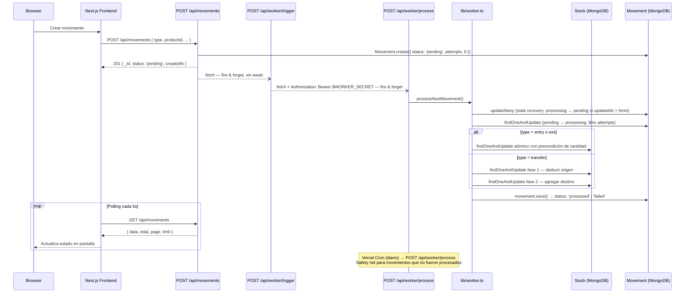

# PROCESS.md

---

## Resumen ejecutivo

Tres decisiones definen la arquitectura de este sistema:

1. **`Stock` como colección separada** — habilita updates atómicos con precondición de cantidad sin locks explícitos, la única forma de evitar race conditions en stock bajo concurrencia.
2. **Worker con claim atómico `pending → processing`** — garantiza single-consumer aunque Vercel Cron dispare invocaciones solapadas; los errores se clasifican como `retryable` o `non-retryable` para no gastar intentos en fallos definitivos.
3. **Polling en cliente cada 5s** — decisión honesta para el entorno serverless donde WebSockets y SSE requieren infraestructura adicional no justificada en este scope.

---

## Cómo abordé el problema

### Punto de partida

Los primeros 30 minutos los dediqué exclusivamente a diseño en papel, sin abrir el editor.

El primer artefacto que produje no fue un diagrama de arquitectura sino una máquina de estados para el ciclo de vida de un movimiento: qué transiciones son válidas, qué las dispara, qué puede fallar en cada paso y qué garantías ofrece el sistema ante cada tipo de fallo. Todo lo demás —CRUD, dashboard, reportes— es estándar. La complejidad real está en garantizar que el procesamiento async sea correcto bajo concurrencia, incluso en un entorno serverless sin estado compartido entre invocaciones.

Con ese modelo claro, las decisiones de stack se volvieron consecuencias, no elecciones: Next.js en Vercel elimina fricción de deploy y CORS; `Stock` como colección separada es la única forma de hacer updates atómicos sin locks explícitos; Vercel Cron es el mecanismo de scheduling disponible cuando no hay proceso long-running.

El approach de desarrollo fue **feature-driven por vertical slices**: cada feature se termina de modelo a UI antes de pasar a la siguiente. En 48 horas, tener el backend completo y el frontend a medias es un fracaso; tener el core funcionando end-to-end con features secundarias en buen estado es una entrega defendible.

### Endpoints definidos antes de escribir código

| Método   | Ruta                  | Descripción                                               |
| -------- | --------------------- | --------------------------------------------------------- |
| `GET`    | `/api/products`       | Listar productos (paginado: `?page&limit`)                |
| `POST`   | `/api/products`       | Crear producto                                            |
| `PUT`    | `/api/products/[id]`  | Editar producto                                           |
| `DELETE` | `/api/products/[id]`  | Eliminar producto                                         |
| `GET`    | `/api/branches`       | Listar sucursales                                         |
| `POST`   | `/api/branches`       | Crear sucursal                                            |
| `PUT`    | `/api/branches/[id]`  | Editar sucursal                                           |
| `DELETE` | `/api/branches/[id]`  | Eliminar sucursal                                         |
| `GET`    | `/api/stock`          | Stock total y por sucursal (`?branchId&productId`)        |
| `POST`   | `/api/movements`      | Crear movimiento → responde `201 { status: 'pending' }`   |
| `GET`    | `/api/movements`      | Listar con filtros (`?status&branchId&page&limit`)        |
| `GET`    | `/api/movements/[id]` | Detalle de movimiento                                     |
| `POST`   | `/api/worker/process` | Trigger interno del worker (no público — ver decisión #2) |
| `GET`    | `/api/reports`        | Reporte agregado por rango de fechas, tipo y sucursal     |

**Nota sobre el worker:** El endpoint del worker usa `POST`, no `GET`. Un `GET` con side-effects viola la semántica HTTP — los GETs deben ser seguros e idempotentes. El worker modifica estado (toma ownership de jobs, actualiza stocks), por lo que `POST` es el método correcto. El endpoint está protegido con `Authorization: Bearer $WORKER_SECRET` verificado en el handler; el secret vive únicamente en variables de entorno del servidor, nunca en el cliente.

**Nota sobre el trigger manual desde el frontend:** El frontend puede disparar el worker inmediatamente al crear un movimiento (para no esperar el cron). Este trigger va a través de un endpoint separado `/api/worker/trigger` — una ruta interna de Next.js que tiene acceso al secret del servidor y llama al worker directamente, sin exponer el token al navegador.El worker se dispara desde el cliente inmediatamente al crear un movimiento vía POST /api/worker/trigger. El Vercel Cron (plan Hobby — una vez al día) actúa como safety net para movimientos que no fueron procesados. Esta separación entre trigger de UX y cleanup periódico es más robusta que depender únicamente del cron: el sistema procesa en segundos en condiciones normales y no depende de la frecuencia del scheduler.

### Qué prioricé primero

1. Schema completo y conexión a DB — define las garantías del sistema antes del primer handler
2. Máquina de estados del movimiento y el worker — el core del reto; todo lo demás depende de esto
3. CRUD de productos y sucursales — necesario para que el flujo de movimiento tenga datos reales
4. Dashboard con polling — lo que el evaluador verá en vivo
5. Reportes — read-only, no bloquea ningún otro flujo

### Qué dejé para el final

- Polish visual y estados de error en UI
- Esta documentación (ensamblada desde notas tomadas durante el desarrollo)

### Estrategia de commits

Los commits fueron planeados antes de escribir código. Cada uno representa un estado funcional del sistema:

```
docs: project planning, architecture decisions, and challenge description
feat: initial Next.js setup + MongoDB connection + env validation
feat: product and branch models + CRUD routes + zod schemas
feat: stock model with compound index { productId, branchId }
feat: movement model with status state machine
feat: POST /api/movements — accepts and returns pending immediately
feat: worker core — atomic ownership claim + stock update
feat: retry logic — retryable vs non-retryable error classification
feat: transfer movement — two-phase update with compensation
feat: dashboard UI with status polling
feat: reports endpoint and view
test: worker happy path + insufficient stock + idempotency
docs: complete README and PROCESS.md
```

## Diagrama de arquitectura

### Flujo completo de un movimiento



### Máquina de estados del movimiento

```text
                   ┌──────────────────────────────────────────┐
                   │  stale recovery (updatedAt > 5 min)      │
                   ▼                                          │
  ┌─────────┐    ┌────────────┐    ┌───────────┐             │
  │ pending │───▶│ processing │───▶│ processed │             │
  └─────────┘    └────────────┘    └───────────┘             │
       ▲               │                                      │
       └───────────────┘              ┌────────┐             │
       retryable error                │ failed │◀────────────┘
       + attempts < 2                 └────────┘
                           non-retryable error
                           OR retryable + attempts >= MAX_ATTEMPTS (2)
```

### Paso a paso de un movimiento completo

1. **Cliente** envía `POST /api/movements { type: "exit", productId, fromBranchId, quantity }`
2. **Route handler** valida con `CreateMovementSchema` (Zod `discriminatedUnion`) — si falla, 400
3. Se crea el documento: `status: "pending"`, `attempts: 0`, `processedAt: null`
4. **Respuesta 201** `{ _id, status: "pending", createdAt }` — no espera al worker
5. Fire-and-forget a `POST /api/worker/trigger` (sin `await`)
6. **Trigger** hace fire-and-forget a `POST /api/worker/process` con `Authorization: Bearer $WORKER_SECRET`
7. **Worker** ejecuta `processNextMovement()`:
   - Stale recovery: resetea jobs atascados en `processing` con `updatedAt > 5min`
   - Claim atómico: `pending → processing`, `$inc: { attempts: 1 }` en un solo `findOneAndUpdate`
   - Guard de idempotencia: si `processedAt` ya existe, normaliza a `processed` y sale
   - Procesamiento según `type` con update atómico de stock
   - Resolución: `processed` con `processedAt = now()`, o `failed` con `failReason`
8. **Cliente** ve el cambio de estado en el siguiente poll (≤ 5 segundos)

---

## Modelo de consistencia y garantías

### Lo que el sistema GARANTIZA

#### Single-consumer via claim atómico

Solo una invocación del worker puede procesar un movimiento dado, incluso si el Vercel Cron y el trigger de UX se solapan:

```typescript
// lib/worker.ts — paso 2
const movement = await Movement.findOneAndUpdate(
  { status: "pending", attempts: { $lt: MAX_ATTEMPTS } },
  { $set: { status: "processing" }, $inc: { attempts: 1 } },
  { new: true, sort: { createdAt: 1 } }
);
```

MongoDB ejecuta esto atómicamente en el servidor. Si dos workers ejecutan esta línea simultáneamente, solo uno obtiene el documento; el otro recibe `null` y sale con `{ processed: false }`.

**Atomicidad de updates de stock para `entry` y `exit`**

La verificación de cantidad y el decremento suceden en una sola operación:

```typescript
// entry — siempre incrementa (upsert si no existe)
await Stock.findOneAndUpdate(
  { productId: movement.productId, branchId: movement.toBranchId },
  { $inc: { quantity: movement.quantity } },
  { upsert: true, new: true }
);

// exit — solo actualiza si hay stock suficiente
const result = await Stock.findOneAndUpdate(
  {
    productId: movement.productId,
    branchId: movement.fromBranchId,
    quantity: { $gte: movement.quantity },
  },
  { $inc: { quantity: -movement.quantity } },
  { new: true }
);
if (!result) throw new InsufficientStockError();
```

No existe ventana entre "verificar stock" y "decrementar stock". Si `result` es `null`, el documento no fue modificado.

**`processed` implica stock actualizado**

El movimiento solo transiciona a `processed` después de que el update de stock fue exitoso:

```typescript
// lib/worker.ts — paso 5a
movement.status = "processed";
movement.processedAt = new Date();
await movement.save();
```

#### `failed` no tiene efecto neto en stock

`InsufficientStockError` es non-retryable y se lanza antes de cualquier modificación (el `findOneAndUpdate` con precondición retorna `null` sin tocar el documento). En `transfer`, si la fase 2 falla, la compensación revierte la fase 1 antes de marcar `failed`.

#### Stale job recovery cada ciclo

```typescript
// lib/worker.ts — paso 1
const staleResult = await Movement.updateMany(
  {
    status: "processing",
    updatedAt: { $lt: new Date(Date.now() - 5 * 60 * 1000) },
  },
  { $set: { status: "pending" } }
);
```

Si una invocación crashea después del claim y antes de la resolución, el documento queda en `processing`. En el siguiente ciclo este `updateMany` lo detecta y lo resetea a `pending`.

#### Guard de idempotencia

```typescript
// lib/worker.ts — paso 3
if (movement.processedAt) {
  movement.status = "processed";
  await movement.save();
  return { processed: true, movementId };
}
```

Si el worker reclama un movimiento que ya tiene `processedAt` (crash entre el stock update y el `movement.save()`), normaliza el estado sin aplicar el cambio de stock nuevamente.

### Lo que el sistema NO garantiza

#### Atomicidad multi-documento en transferencias

Las dos operaciones de stock en un `transfer` son operaciones MongoDB separadas. Si el proceso crashea entre la fase 1 (decremento del origen) y la fase 2 (incremento del destino), el stock queda temporalmente inconsistente hasta que el stale recovery reactive el movimiento y la compensación revierta la fase 1.

#### Consistencia inmediata si falla el trigger

El fire-and-forget a `/api/worker/trigger` puede fallar silenciosamente. En ese caso, el movimiento queda en `pending` hasta el próximo Vercel Cron (plan Hobby: una vez al día). En condiciones normales la latencia es < 5 segundos.

#### Exactly-once en caso de crash mid-update

Si el proceso crashea después del update de stock pero antes de `movement.save()`, el stale recovery reintentará el movimiento. El guard de idempotencia cubre el caso donde `processedAt` ya existe, pero si el crash ocurrió antes de setear `processedAt`, el update de stock se aplicará dos veces. Este es el gap de consistencia conocido del sistema.

---

## Decisión #2 — Worker con claim atómico y clasificación de errores

### Por qué el claim atómico es crítico

El Vercel Cron puede solapar invocaciones si un job tarda más que el intervalo del cron, o si hay múltiples instancias. Sin un mecanismo de ownership, ambas invocaciones procesarían el mismo movimiento, resultando en doble descuento de stock. La solución es usar `findOneAndUpdate` como operación atómica de "tomar ownership":

```typescript
const movement = await Movement.findOneAndUpdate(
  { status: "pending", attempts: { $lt: MAX_ATTEMPTS } },
  { $set: { status: "processing" }, $inc: { attempts: 1 } },
  { new: true, sort: { createdAt: 1 } }
);
```

MongoDB ejecuta esto de forma atómica en el servidor. No existe gap entre "leer" y "escribir". Si dos workers ejecutan esta línea simultáneamente, solo uno obtiene el documento.

### Por qué POST y no GET para el endpoint del worker

Un `GET` con side-effects viola la semántica HTTP — los GETs deben ser seguros (sin efectos) e idempotentes. El worker modifica estado en cada invocación: reclama ownership, actualiza stocks, cambia el status del movimiento. `POST` es el único método correcto. Adicionalmente, el endpoint está protegido:

```typescript
// app/api/worker/process/route.ts
const authHeader = req.headers.get("authorization");
if (authHeader !== `Bearer ${env.WORKER_SECRET}`) {
  return NextResponse.json({ error: "No autorizado" }, { status: 401 });
}
```

El secret vive únicamente en variables de entorno del servidor. El cliente nunca lo ve — solo interactúa con `/api/worker/trigger`.

### Cómo funciona el stale job recovery

Si una invocación del worker crashea después de reclamar un movimiento pero antes de resolverlo, el documento queda atascado en `processing`. En el siguiente ciclo, el primer paso del worker detecta esto:

```typescript
await Movement.updateMany(
  {
    status: "processing",
    updatedAt: { $lt: new Date(Date.now() - 5 * 60 * 1000) },
  },
  { $set: { status: "pending" } }
);
```

El umbral de 5 minutos evita interferir con jobs que están procesándose normalmente. `updatedAt` se actualiza automáticamente via `timestamps: true` en el claim, reiniciando el timer correctamente en cada intento.

### Clasificación retryable / non-retryable

```typescript
export function classifyError(err: unknown): "retryable" | "non-retryable" {
  if (err instanceof InsufficientStockError) return "non-retryable";
  if (err instanceof CompensationError) return "non-retryable";
  if (err instanceof mongoose.Error.ValidationError) return "non-retryable";
  // MongoNetworkError vive en el driver nativo dentro de mongoose.mongo
  if (
    err instanceof Error &&
    (err.name === "MongoNetworkError" || err.name === "MongoServerSelectionError")
  ) {
    return "retryable";
  }
  // Conservador: reintentar ante cualquier error desconocido
  return "retryable";
}
```

### Por qué InsufficientStockError es non-retryable

Si no hay stock suficiente ahora, no habrá más en el próximo intento — ningún proceso reabastece el stock automáticamente entre reintentos. Reintentar desperdiciaría uno de los dos intentos disponibles y retrasaría la señal de error al operador. El problema requiere intervención humana (crear un movimiento `entry`) antes de que el `exit` pueda procesarse.

### Test real — exit con stock insuficiente

```json
POST /api/movements
{ "type": "exit", "productId": "69f1f72d6f5f96e05606ca32",
  "fromBranchId": "69f1f7056f5f96e05606ca30", "quantity": 150 }
```

Stock disponible en Sucursal Norte: 100 — `quantity: 150 > 100`, `InsufficientStockError`. Resultado observado:

```json
{ "attempts": 1, "status": "failed",
  "failReason": "Stock insuficiente para completar el movimiento" }
```

El movimiento falló en el primer intento sin consumir el segundo, porque `InsufficientStockError` es non-retryable. El mecanismo de retry solo aplica a errores retryable.

---

## Observabilidad

El worker emite logs estructurados en JSON en cada paso crítico. En Vercel, estos aparecen en la pestaña **Logs** del proyecto y se pueden filtrar por `movementId`.

### Eventos implementados

**`worker.stale.recovered`** — Stale recovery activado

Disparado cuando al menos un movimiento atascado en `processing` fue reseteado a `pending`. Solo se emite si `modifiedCount > 0`.

```json
{ "event": "worker.stale.recovered", "count": 1 }
```

| Campo    | Descripción                                        |
| -------- | -------------------------------------------------- |
| `count`  | Número de movimientos recuperados en este ciclo    |

---

**`worker.job.claimed`** — Movimiento reclamado exitosamente

Disparado inmediatamente después del claim atómico, antes de cualquier procesamiento.

```json
{ "event": "worker.job.claimed", "movementId": "...", "type": "exit", "attempts": 1 }
```

| Campo        | Descripción                                        |
| ------------ | -------------------------------------------------- |
| `movementId` | ID del movimiento reclamado                        |
| `type`       | `"entry"` / `"exit"` / `"transfer"`                |
| `attempts`   | Número de intento actual, post-incremento          |

---

**`worker.job.done`** — Movimiento procesado exitosamente

Disparado después de persistir `status: "processed"`.

```json
{ "event": "worker.job.done", "movementId": "...", "status": "processed", "durationMs": 35 }
```

| Campo | Descripción |
|---|---|
| `movementId` | ID del movimiento procesado |
| `status` | Siempre `"processed"` |
| `durationMs` | Tiempo transcurrido desde el claim hasta la resolución |

---

**`worker.job.failed`** — Movimiento fallido o pendiente de reintento

Disparado después de persistir `status: "failed"` (non-retryable o sin intentos restantes) o `status: "pending"` (retryable con intentos disponibles).

```json
{ "event": "worker.job.failed", "movementId": "...", "errorClass": "InsufficientStockError",
  "attempts": 1, "failReason": "Stock insuficiente para completar el movimiento" }
```

| Campo | Descripción |
|---|---|
| `movementId` | ID del movimiento |
| `errorClass` | Nombre de la clase del error (`InsufficientStockError`, `MongoNetworkError`, etc.) |
| `attempts` | Total de intentos consumidos hasta este punto |
| `failReason` | Mensaje del error — coincide con el campo `failReason` del documento en DB |

---

**`worker.transfer.compensation_failed`** — Compensación fallida en transfer

Disparado si la fase 1 del transfer fue aplicada pero tanto la fase 2 como la compensación fallaron. El stock del origen puede estar inconsistente y requiere intervención manual.

```json
{ "event": "worker.transfer.compensation_failed", "movementId": "..." }
```

| Campo | Descripción |
|---|---|
| `movementId` | ID del movimiento afectado — usar para localizar y corregir el stock manualmente |

### Cómo filtrar en Vercel Logs

En la pestaña **Logs** de Vercel, busca por `movementId` para seguir el ciclo de vida completo de un movimiento:

```
<movementId>
```

Todos los eventos de un mismo movimiento comparten el mismo `movementId`. La secuencia esperada en el caso feliz es: `worker.job.claimed` → `worker.job.done`. En caso de error: `worker.job.claimed` → `worker.job.failed` (con `status: "pending"` si hay reintentos, o `"failed"` si es definitivo).

---

## Herramientas utilizadas

| Herramienta           | Propósito                                                                                                                                                                                                                                 |
| --------------------- | ----------------------------------------------------------------------------------------------------------------------------------------------------------------------------------------------------------------------------------------- |
| VS Code + Claude Code | Editor principal — Claude Code usado para generación de boilerplate (modelos, schemas Zod, estructura de componentes) y debugging. El razonamiento de arquitectura y las decisiones de diseño fueron propias; la IA aceleró la ejecución. |
| MongoDB Atlas         | DB cloud en free tier — cluster configurado antes de escribir código                                                                                                                                                                      |
| Vercel                | Deploy — conectado a GitHub, auto-deploy en push a `main`                                                                                                                                                                                 |
| shadcn/ui             | Componentes UI — `Badge`, `Table`, `Select` para el dashboard                                                                                                                                                                             |
| Thunder Client        | Testing manual de API durante el desarrollo del backend                                                                                                                                                                                   |
| GitHub                | Control de versiones — commits atómicos y planeados                                                                                                                                                                                       |

**Sobre testing:** Se eligió no hacer TDD dado el tiempo disponible y la velocidad con que el schema evolucionó en las primeras horas. Los tests se escribieron después de que el worker estuvo estable, enfocados en tres casos: happy path, stock insuficiente como error non-retryable, e idempotencia del worker ante invocaciones duplicadas. Estos tres casos cubren el comportamiento más crítico del sistema sin gastar tiempo en cobertura superficial.

**Sobre navegabilidad del código:** El código está estructurado para ser modificable bajo presión, no solo legible. El worker vive en `lib/worker.ts` completamente separado del route handler. Las funciones tienen nombres que expresan intención (`claimMovement`, `validateAndDeductStock`, `classifyError`, `retryOrFail`). Los comentarios existen donde la lógica no es obvia —especialmente en el pattern de ownership atómico y la compensación de transferencias.
